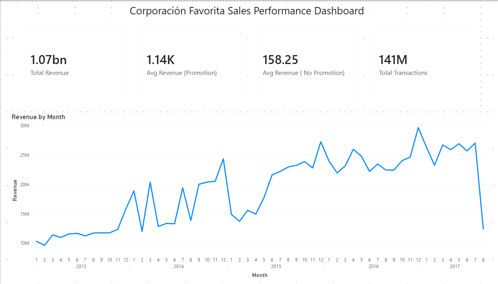
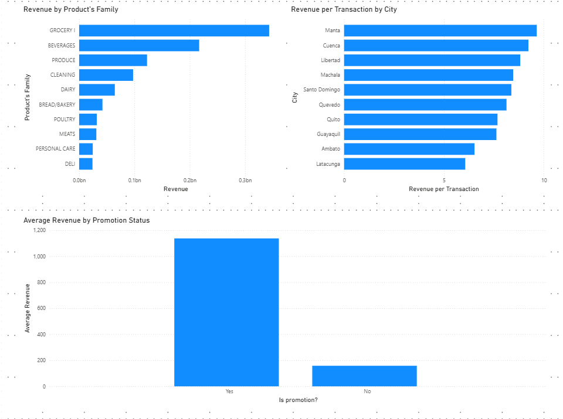

# Sales Forecasting Analysis

## Project Overview

This project analyzes historical grocery sales data from Corporación Favorita, one of Ecuador's largest retail chains.

Dataset source: Kaggle – Store Sales Time Series Forecasting
https://www.kaggle.com/competitions/store-sales-time-series-forecasting/data

The goal of the project is to build an end-to-end analytics workflow covering:

- Data ingestion and ETL development
- PostgreSQL database design
- SQL-based business analysis
- Power BI dashboarding
- Sales trend and seasonality analysis

The dataset contains over 3 million sales records across 54 stores and 33 product families between 2013 and 2017.

---

## Business Questions

This project aims to answer the following business questions:

- How has revenue evolved over time?
- Which stores generate the highest revenue?
- Which product families contribute most to total revenue?
- How do promotions impact sales performance?
- Are there recurring seasonal sales patterns?
- Which stores generate the highest revenue per transaction?

---

## Tech Stack

- Python (Pandas, SQLAlchemy, Psycopg2)
- PostgreSQL
- SQL
- Power BI
- Git & GitHub

---

## Data Pipeline

Raw CSV Files
↓
Python ETL
↓
PostgreSQL
↓
SQL Analysis
↓
Power BI Dashboard

---

## Repository Structure

```text
sales-forecasting-analysis/
│
├── data/
│   └── raw/
│
├── python/
│   ├── data_exploration.py
│   └── etl_load.py
│
├── sql/
│   ├── create_tables.sql
│   ├── 01_data_quality_checks.sql
│   ├── 02_sales_analysis.sql
│   ├── 03_store_analysis.sql
│   ├── 04_product_analysis.sql
│   ├── 05_forecast_preparation.sql
│   └── 06_dashboard_views.sql
├── screenshots/
│   ├── Dashboard_1.png
│   └── Dashboard_2.png
|
├── .env.example
├── requirements.txt
└── README.md
```
---
## Key Insights

### Promotion Effectiveness

Products under promotion generated significantly higher average sales than non-promotional products, indicating a strong relationship between promotional activity and sales performance.

### Product Family Performance

Grocery I, Beverages, and Produce generated the highest revenue, highlighting the importance of everyday consumer goods in overall sales performance.

### Seasonal Demand Patterns

December consistently ranked among the strongest revenue months, while February regularly recorded the lowest revenue, revealing recurring seasonal demand patterns.

### Store Performance

Store 51 generated the highest revenue per transaction despite not ranking among the stores with the highest transaction volume, suggesting stronger transaction value compared to many higher-traffic stores.

---

## Dashboard Features

The Power BI dashboard provides:

- Executive KPI overview
- Revenue trend analysis over time
- Product family performance comparison
- Revenue per transaction analysis by city
- Promotion effectiveness analysis

---

## Dashboard Preview

### Sales Performance Dashboard


### Business Performance Analysis


---
## Future Improvements

- Develop sales forecasting models
- Analyze holiday impact on sales performance
- Explore store clustering and segmentation
- Build predictive demand forecasting solutions